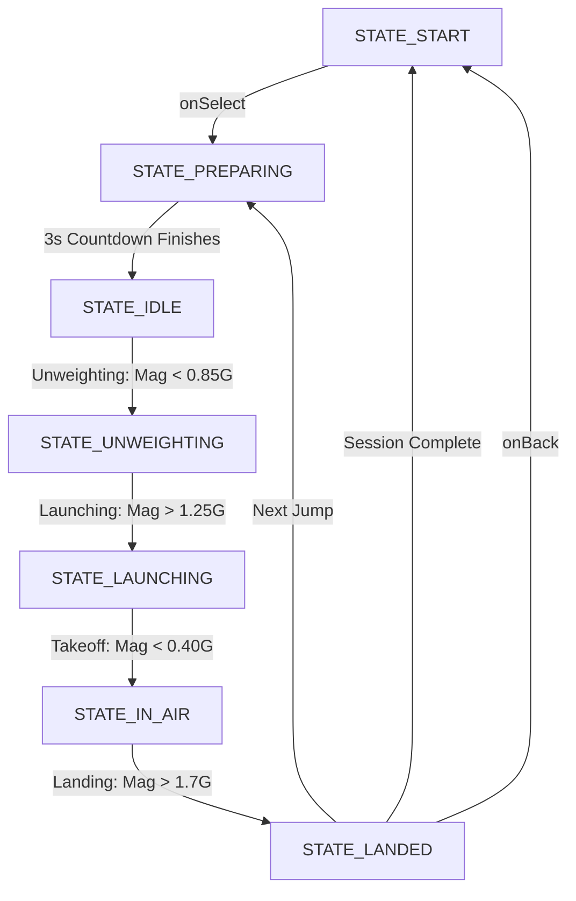
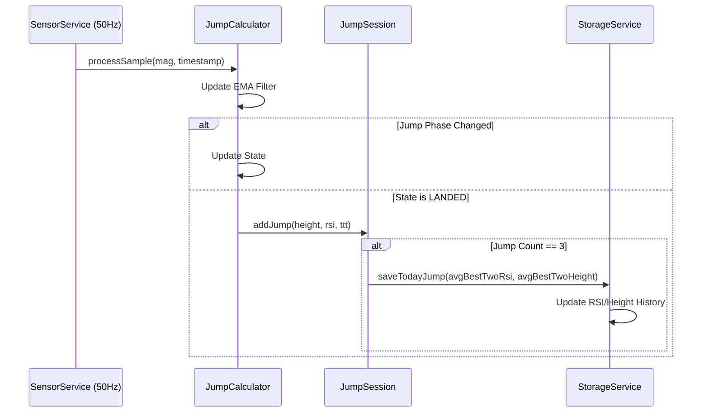
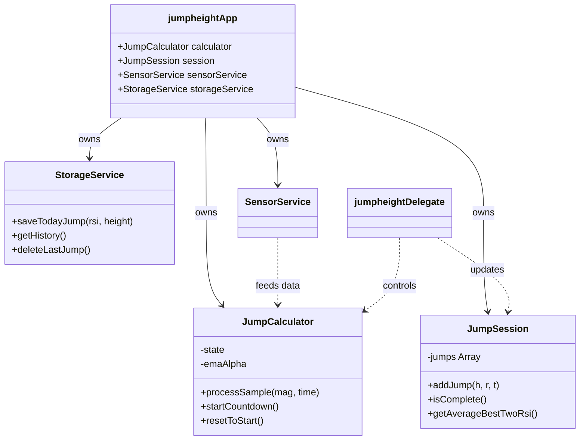

# Technical Architecture 🏗️

This document explains the internal logic, state management, and signal processing used in **JumpRSI**.

## 1. Jump Detection State Machine
The core of the app is the `JumpCalculator` class, which implements a robust state machine to detect the different phases of a Countermovement Jump (CMJ) from accelerometer magnitude ($G$).

## 2. Signal Processing & Precision
To achieve sub-millisecond precision with a 50Hz (20ms) sensor rate, we use two key techniques:

### EMA (Exponential Moving Average) Filter
We apply a low-pass EMA filter ($\alpha = 0.45$) to the raw magnitude to reduce sensor noise while maintaining responsiveness:
$$y[n] = \alpha \cdot x[n] + (1 - \alpha) \cdot y[n-1]$$
We also compensate for the filter's phase lag ($\tau$) when calculating timestamps.

### Linear Interpolation
When a threshold is crossed (e.g., the 0.4G takeoff threshold), we don't just use the current sample's timestamp. We interpolate between the current and last sample to find the exact moment the threshold was crossed:
$$t_{precise} = t_{prev} + (t_{curr} - t_{prev}) \cdot \frac{Threshold - mag_{prev}}{mag_{curr} - mag_{prev}}$$

## 3. System Data Flow
The following diagram shows how data flows from the Garmin sensors to persistent storage.

## 4. Class Architecture
The app follows a clean separation of concerns, decoupling the signal processing logic from the UI and storage.

