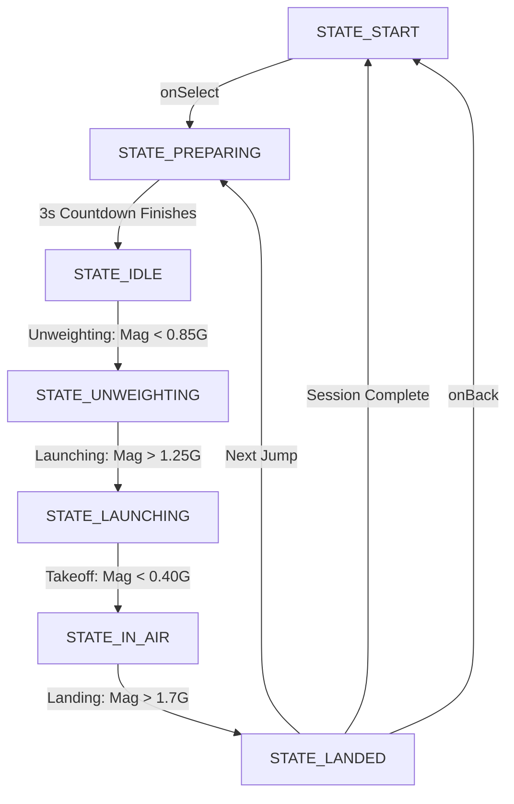
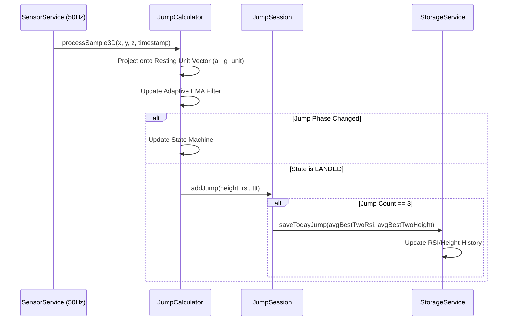
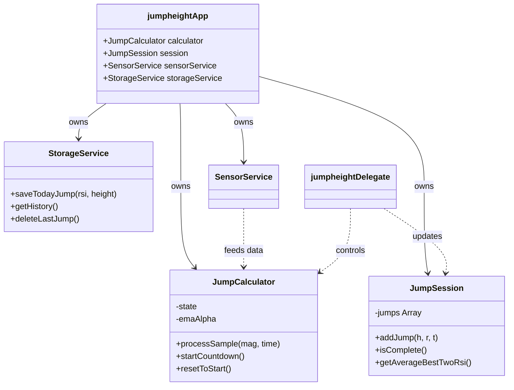

# Technical Architecture 🏗️

This document explains the internal logic, state management, and signal processing used in **JumpRSI**.

## 1. Jump Detection State Machine
The core of the app is the `JumpCalculator` class, which implements a robust state machine to detect the different phases of a Countermovement Jump (CMJ) from accelerometer magnitude ($G$).

```mermaid
graph TD
    A[STATE_START] -->|onSelect| B[STATE_PREPARING]
    B -->|3s Countdown Finishes| C[STATE_IDLE]
    C -->|Unweighting: Mag < 0.85G| D[STATE_UNWEIGHTING]
    D -->|Launching: Mag > 1.25G| E[STATE_LAUNCHING]
    E -->|Takeoff: Mag < 0.40G| F[STATE_IN_AIR]
    F -->|Landing: Mag > 1.7G| G[STATE_LANDED]
    G -->|Next Jump| B
    G -->|Session Complete| A
    G -->|onBack| A
```

## 2. Signal Processing & Precision
To achieve high precision across variable sensor rates (25Hz - 100Hz), we combine 3D vector calibration, low-pass EMA filtering, and sub-sample linear interpolation:

### 3D Gravity Vector Orientation Calibration ($\mathbf{a} \cdot \mathbf{\hat{g}}$)
Standard 3D Euclidean vector magnitude ($\sqrt{x^2+y^2+z^2}$) is non-negative and **rectifies** zero-mean sensor noise into a positive bias (shifting $0g$ free-fall to $\sim 0.1g$). To prevent this:
1. During the 3-second calibration phase (`STATE_PREPARING`), the app records the mean resting 3D acceleration vector $\mathbf{g}_{rest} = (\bar{x}, \bar{y}, \bar{z})$ and calculates its unit direction vector $\mathbf{\hat{g}} = \frac{\mathbf{g}_{rest}}{\|\mathbf{g}_{rest}\|}$.
2. For each incoming sample $(x, y, z)$, we compute the **projected signed vertical acceleration**:
   $$a_{vert} = \mathbf{a} \cdot \mathbf{\hat{g}} = \frac{x \bar{x} + y \bar{y} + z \bar{z}}{\|\mathbf{g}_{rest}\|}$$
3. This linear, signed projection allows zero-mean noise to cancel naturally during free fall ($0.0g$) and preserves pure physics calculation ($h = \frac{g \cdot t_{flight}^2}{8}$) without arbitrary correction multipliers.

### Adaptive EMA (Exponential Moving Average) Filter
We apply a sample-rate adaptive low-pass EMA filter ($\alpha = 0.45$ at 50Hz, constant $RC = 24.44\text{ms}$) to the projected vertical signal to reduce sensor noise while maintaining constant cutoff frequency:
$$y[n] = \alpha \cdot x[n] + (1 - \alpha) \cdot y[n-1]$$
Filter phase lag $\tau = \frac{1 - \alpha}{\alpha} \cdot \Delta t$ is subtracted from all transition timestamps for phase-accurate event timing.

### Sub-Sample Linear Interpolation
When a threshold is crossed (e.g. $0.40g$ takeoff threshold or $1.60g$ landing threshold), we interpolate between adjacent samples for exact sub-millisecond timestamping:
$$t_{precise} = t_{prev} + (t_{curr} - t_{prev}) \cdot \frac{Threshold - signal_{prev}}{signal_{curr} - signal_{prev}} - \tau_{ema}$$

## 3. System Data Flow
The following diagram shows how 3D data flows from the Garmin sensors to persistent storage.

```mermaid
sequenceDiagram
    participant S as SensorService (50Hz)
    participant C as JumpCalculator
    participant JS as JumpSession
    participant SS as StorageService
    
    S->>C: processSample3D(x, y, z, timestamp)
    C->>C: Project onto Resting Unit Vector (a · g_unit)
    C->>C: Update Adaptive EMA Filter
    alt Jump Phase Changed
        C->>C: Update State Machine
    else State is LANDED
        C->>JS: addJump(height, rsi, ttt)
        alt Jump Count == 3
            JS->>SS: saveTodayJump(avgBestTwoRsi, avgBestTwoHeight)
            SS->>SS: Update RSI/Height History
        end
    end
```

## 4. Class Architecture
The app follows a clean separation of concerns, decoupling the signal processing logic from the UI and storage.

```mermaid
classDiagram
    class jumpheightApp {
        +JumpCalculator calculator
        +JumpSession session
        +SensorService sensorService
        +StorageService storageService
    }
    class JumpCalculator {
        -state
        -emaAlpha
        +processSample(mag, time)
        +startCountdown()
        +resetToStart()
    }
    class JumpSession {
        -jumps Array
        +addJump(h, r, t)
        +isComplete()
        +getAverageBestTwoRsi()
    }
    class StorageService {
        +saveTodayJump(rsi, height)
        +getHistory()
        +deleteLastJump()
    }
    jumpheightApp --> JumpCalculator : owns
    jumpheightApp --> JumpSession : owns
    jumpheightApp --> SensorService : owns
    jumpheightApp --> StorageService : owns
    SensorService ..> JumpCalculator : feeds data
    jumpheightDelegate ..> JumpCalculator : controls
    jumpheightDelegate ..> JumpSession : updates
```
