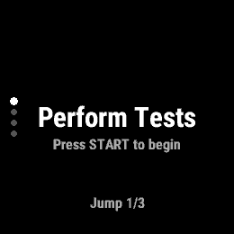
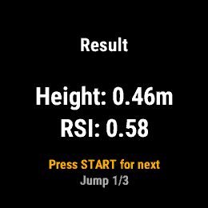
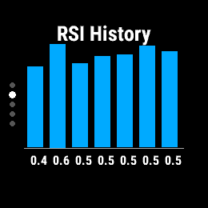
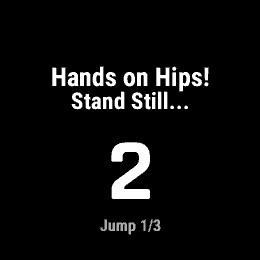
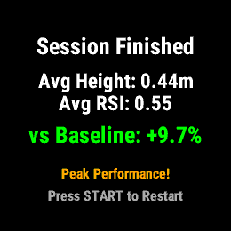
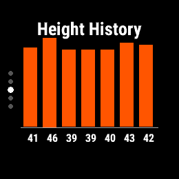
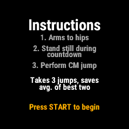

#  JumpRSI ⌚🚀

JumpRSI is a high-performance diagnostic tool for Garmin watches designed to measure and track the **Reactive Strength Index Modified (RSImod)** during Countermovement Jumps (CMJ).

It helps athletes monitor their neuromuscular readiness and explosive power daily, ensuring optimal training intensity and injury prevention.

## 📸 Screenshots
| Jump Protocol | Results & Analysis | History & Trends |
| :---: | :---: | :---: |
|  |  |  |
|  |  |  |

## ✨ Features
- **Precise Measurement:** Uses the **Flight Time (FT)** method with a specific correction factor to align with video-validated jump heights. Comparison with JumPo2 app showed a MAE of 3.83 cm (see issue #2).
- **RSImod Metric:** More than just height—it measures your movement efficiency. RSImod is highly sensitive to fatigue, often dropping by 15-20% when height only changes by 1% [27].
- **Autoregulation Focus:** Use daily trends to decide whether to push or pull back in your training based on scientific thresholds (3-5% drop = early fatigue) [12][19].
- **Best-of-Two Average:** Automatically calculates the average of your best two jumps out of three to filter out technical outliers.
- **Clean UI:** Optimized for Garmin round and square displays with intuitive vertical navigation.

## 🏃 Standard Measurement Protocol
To ensure scientific validity and reliable comparisons, follow this protocol:
1. **Calibrate:** Stand still for 3 seconds after pressing START.
2. **Jump:** Keep **hands on your hips** to isolate lower-body power and avoid koordinative compensation [3]. Perform a full Countermovement Jump when prompted "JUMP!".
3. **Repeat:** Complete 3 jumps per session.
4. **Summary:** View your best-of-two average results.
5. **Analyze:** Swipe up/down to see your 7-day history graphs for RSI and Height.

## 🔬 Scientific Foundation
JumpRSI is built on the foundation of vertical jump analysis as an objective marker of Neuromuscular Fatigue (NMF).
- **Metric:** $RSImod = \frac{Height}{Time to Take-off}$.
- **Rationale:** Jump height alone can be masked by strategy changes (sluggish jumps). RSImod identifies these shifts, making it a superior marker for readiness.
- For a detailed breakdown of the biomechanics, recovery windows, and sensor validity ($r \geq 0.983$), see [RESEARCH.md](./RESEARCH.md).

## ⚠️ Current Challenges & Limitations
While designed with scientific rigor, users should be aware of the following technical challenges:
- **No External Validation:** This specific implementation has not yet been cross-validated against lab-grade force plates or high-speed optoelectric systems.
- **Sensor Noise:** Consumer-grade accelerometers in watches are susceptible to high-frequency noise and vibration. While we use EMA filtering to mitigate this, some "shaking" or sudden wrist movements can still affect takeoff and landing detection.
- **Experimental Status:** This tool is intended for **relative trend monitoring** (comparing your today's score to your own baseline) rather than as a source of absolute, medically-certified data.

## 🏗️ Technical Architecture
JumpRSI uses a complex state machine for jump detection and EMA signal filtering for high precision.
For detailed technical documentation including **Mermaid diagrams**, see [ARCHITECTURE.md](./ARCHITECTURE.md).

## 🎨 Design & UI

The app follows a 5-page navigation cycle designed for quick daily check-ins.
Learn more about the UI architecture in [DESIGN.md](./DESIGN.md).

## ⚖️ License
MIT License. See [LICENSE](./LICENSE) for details.
